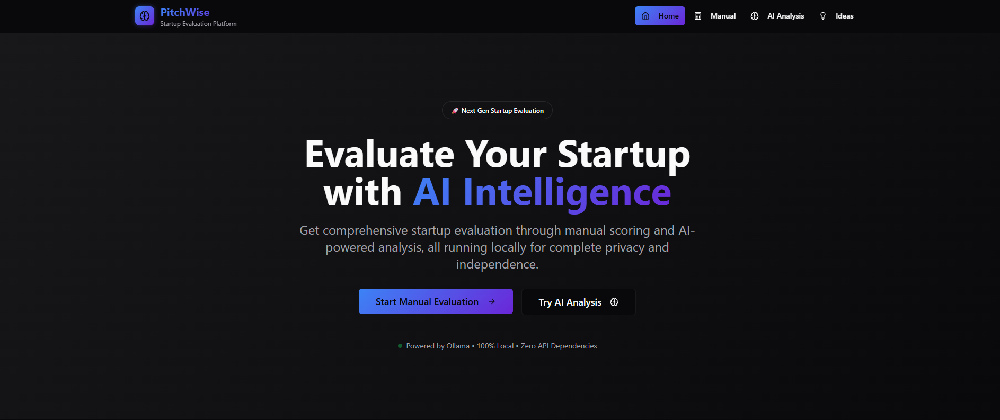
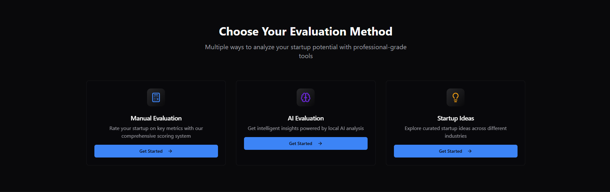
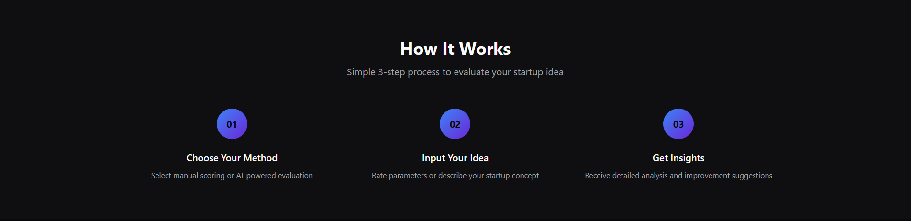
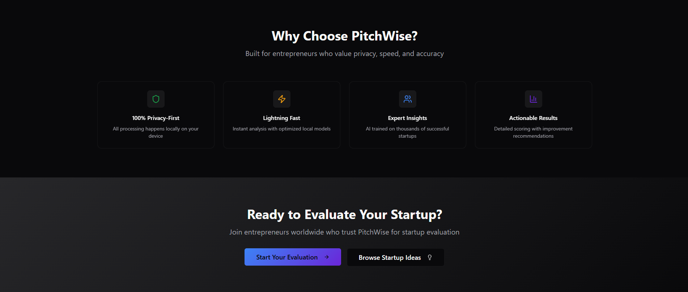
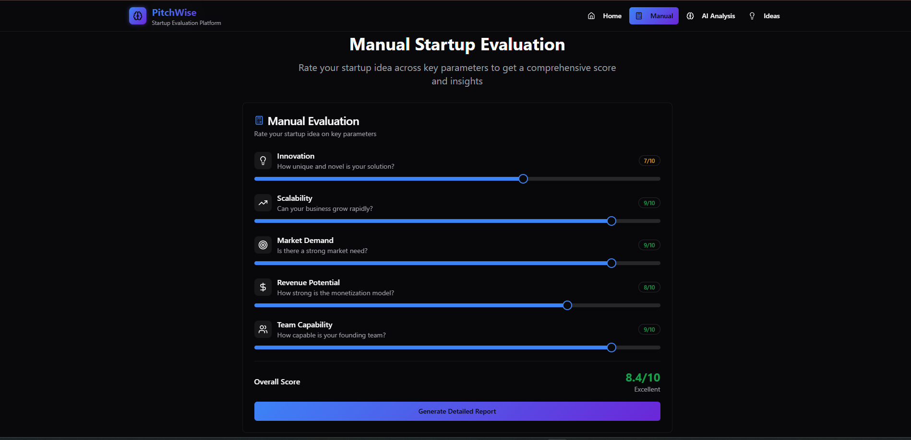
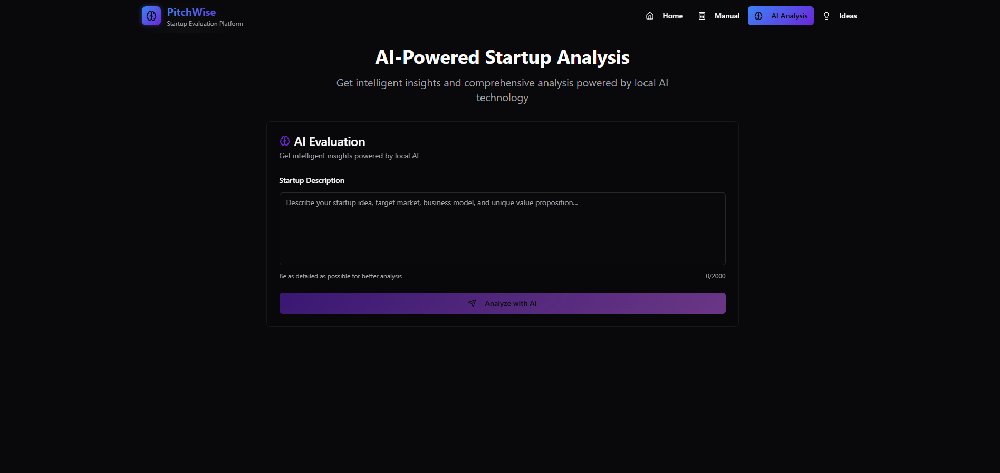
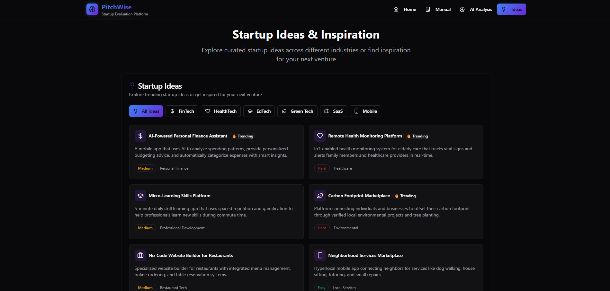

# ⚡ PitchWise - Startup Evaluation Platform

PitchWise is an intelligent startup evaluation tool that enables aspiring entrepreneurs to assess their business ideas through both manual scoring and AI-powered analysis using a local Large Language Model (LLM) — [Mistral](https://ollama.com/library/mistral) via [Ollama](https://ollama.com/).

> 🚀 Built by **Swapnil Naik** — Empowering founders with insight before the pitch!

---

## 📌 Features

- ✅ **Manual Evaluation** – Score your startup on key business parameters.
- 🤖 **AI Evaluation** – Analyze ideas using local LLM (Mistral via Ollama).
- 💡 **Startup Ideas** – View and explore sample business ideas.
- 📄 **PDF Report Generation** – Download a structured report of manual scores.

---

## 🛠️ Tech Stack

| Frontend         | Backend        | AI Engine      |
|------------------|----------------|----------------|
| React + Vite     | Node.js + Express | Ollama (Mistral) |
| Tailwind CSS     | REST API       | Local LLMs     |

---

## 📸 UI Screenshots

<details>
  <summary>📸 UI Screenshots (Click to expand)</summary>

  <br>

  
  
  
  
  
  
  

</details>

---

## 🚀 Getting Started

### 1. Clone the repository

```bash

git clone https://github.com/Ma4k-23/pitchwise.git
cd pitchwise
2. Setup and Run Backend
Install dependencies:

bash

cd backend
npm install
Start Ollama with Mistral model:

bash

ollama run mistral
Then start the backend server:

bash

node server.js
The backend runs at http://localhost:5000

3. Setup and Run Frontend
In a separate terminal:

bash

cd frontend
npm install
npm run dev
The app runs at http://localhost:5173

🧠 How AI Is Used
When a startup idea is submitted, a prompt is sent to the local LLM (Mistral) via Ollama.

The AI responds with a structured evaluation on Innovation, Market, Scalability, and Feasibility.

These scores are displayed along with feedback and suggestions.

No cloud API — all computation happens locally.

📝 PDF Report
In the manual evaluation section, users can generate a PDF report of their scores and download it instantly. The report includes:

Scores for each criterion

Overall score and performance rating

Author
Made by Swapnil Naik


